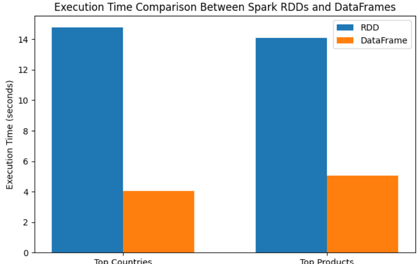

# Spark RDD vs DataFrame Performance Analysis

## Author

Rihem Belgacem

Master's Degree in Computer Science

Big Data Analytics Project

## Project Description

This project compares the performance of Apache Spark RDDs and DataFrames using the Online Retail dataset.

The objective is to evaluate the efficiency of both Spark abstractions when performing common big data analytics tasks such as aggregation, grouping, and sorting.

Two experiments were conducted:

1. Top Countries by Number of Transactions
2. Top Products by Quantity Sold

Execution times were measured and compared for both implementations.

## Technologies Used

- Apache Spark
- PySpark
- Google Colab
- Python

## Dataset

The project uses the Online Retail dataset.

File included in this repository:

- online_retail.zip

## Installation

1. Clone or download this repository.
2. Open the notebook `spark_rdd_vs_dataframe.ipynb` in Google Colab.
3. Upload the dataset file `online_retail.zip`.
4. Run the PySpark installation cell (`pip install pyspark`).
5. Run the Spark configuration cells to create the Spark session.
6. Execute the remaining notebook cells in order.

## Running the Project

1. Execute the dataset loading cells.
2. Run the RDD experiments for country ranking and product ranking.
3. Run the DataFrame experiments for the same analytical tasks.
4. Compare the execution times reported by both implementations.
5. Review the generated results and performance analysis.

## Repository Contents

- `spark_rdd_vs_dataframe.ipynb` : Main notebook containing the Spark RDD and DataFrame experiments.
- `online_retail.zip` : Online Retail dataset used for the analysis.
- `README.md` : Project documentation and execution instructions.

## Results

The experiments demonstrated that Spark DataFrames consistently achieved lower execution times than Spark RDDs for both analytical tasks. Despite the performance difference, both implementations produced identical analytical results, confirming the effectiveness of DataFrames for large-scale data processing workloads.

## Performance Comparison

The figure below summarizes the execution time comparison between Spark RDDs and DataFrames for both analytical tasks.

## License

Academic project developed for the Big Data Analytics course.
